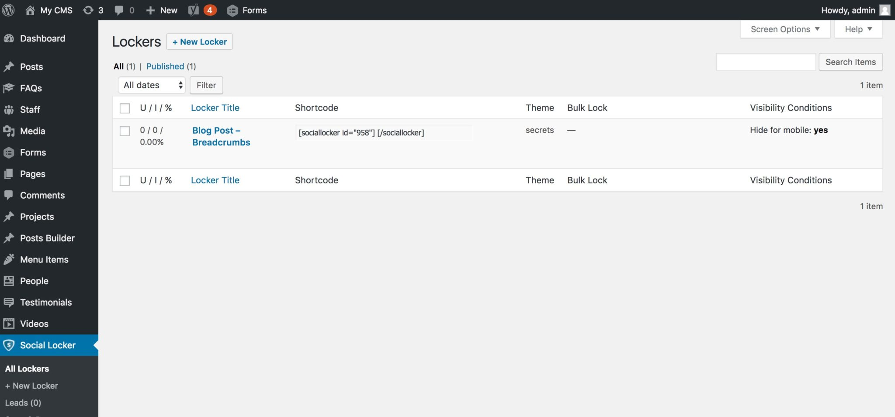
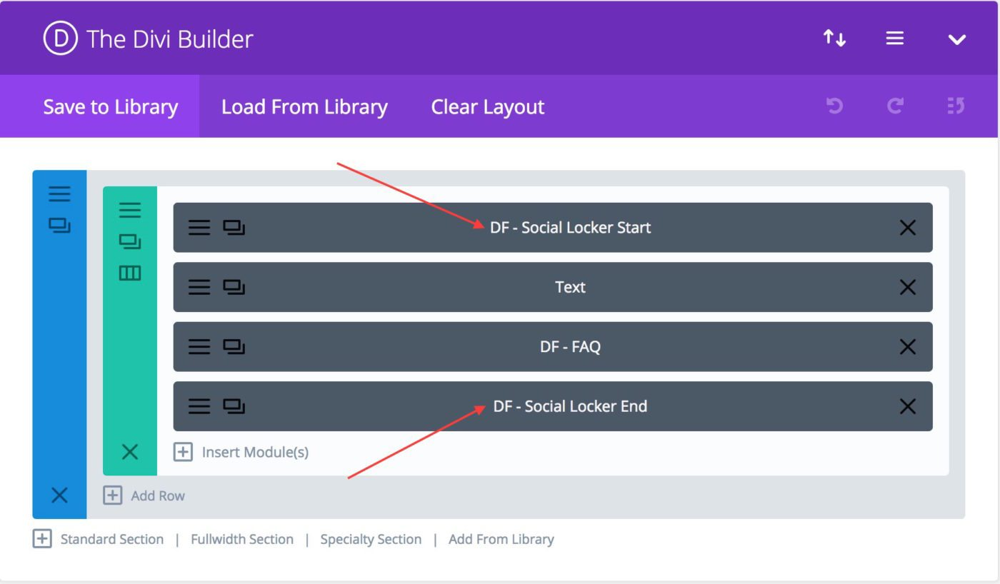
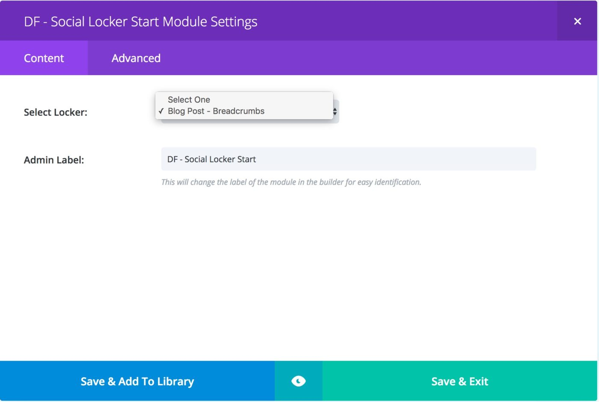
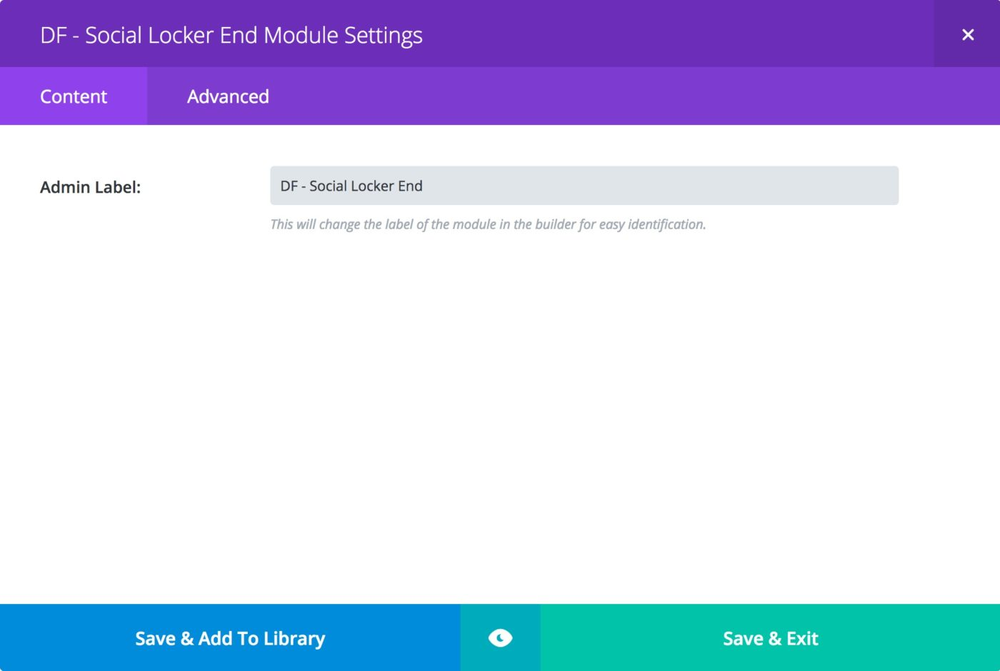
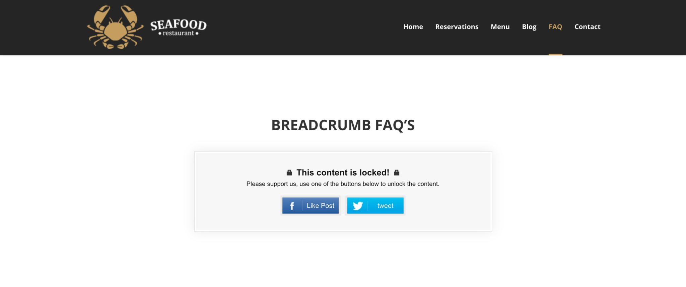

# Social Locker Divi Module - [www.mrkwp.com](https://www.mrkwp.com/)

Do you need help building organic traffic from social networks? This plugin allows you to **lock important content using the Divi Builder**.

With the help of our Divi Modules, you can lock any part of your content and automatically unlock it after a visitor has shared your page on their social media network.

Our Divi Modules use the tried-and-tested [Social Locker plugin](https://wordpress.org/plugins/social-locker/) under the hood.

The Social Locker works by locking your most valuable site content behind a set of social buttons until the visitor likes, shares, +1s or tweets your page.

**It helps to improve social performance of your website, get more likes/shares, build quality followers and attract more traffic from social networks.**

> Note: Headsup! We have moved on to other things & in spirit of GPL2 & WordPress ecosystem we have released the source code. We won't be developing or support this plugin. 

## Features

* Makes it easy to lock content using the Divi Builder
* Provides 2 Divi Modules – one each to start and end the locked content

This is a must have plugin for anyone looking to organically market their website and build a network of quality followers!

## How to

### Add Social Locker Entry

Add and configure social locker entry by visiting **WordPress Admin > Social Locker > New Locker**. Below is a screenshot of Lockers.

### Adding the Social Locker Shortcode Divi Modules to a Page

This plugin has 2 Divi modules which help in identifying the start and end boundary of the social locker.

* **DF – Social Locker Start**: This module indicates the start of the social locking content area.
* **DF – Social Locker End**: This module indicates the end of the social locking content area.

The screenshot below indicates a sample use of the modules inside the Divi Builder on a page.

#### DF – Social Locker Start Module

As the name suggests, the **DF – Social Locker Start Module** indicates the start of the content-locking area.

You need to select a locker in the Select Locker field in the module.

#### DF – Social Locker End Module

This module indicates the end of the content-locking area. This module does not need any options to be configured. It does, however, need to be applied to the page, failing which content-locking won’t work.

This module does not need any options to be configured. It does, however, need to be applied to the page, failing which content-locking won’t work.

### Sample Front End Page

Once the above setup is done, you will see a locker being rendered on the front end page. Below is a sample screenshot.

